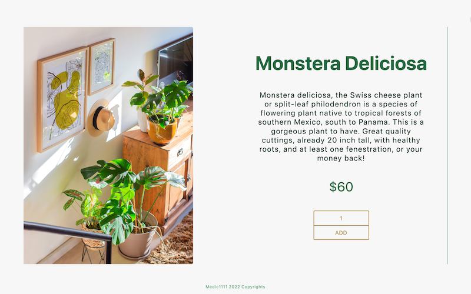
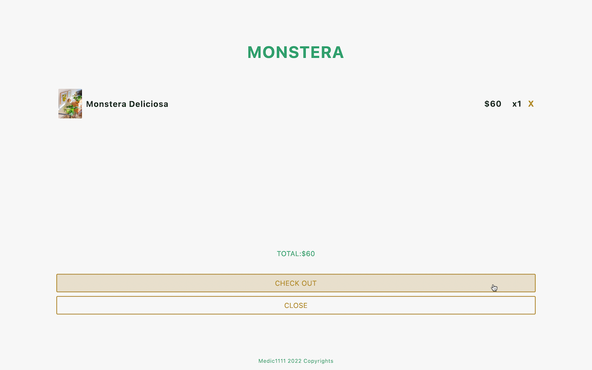
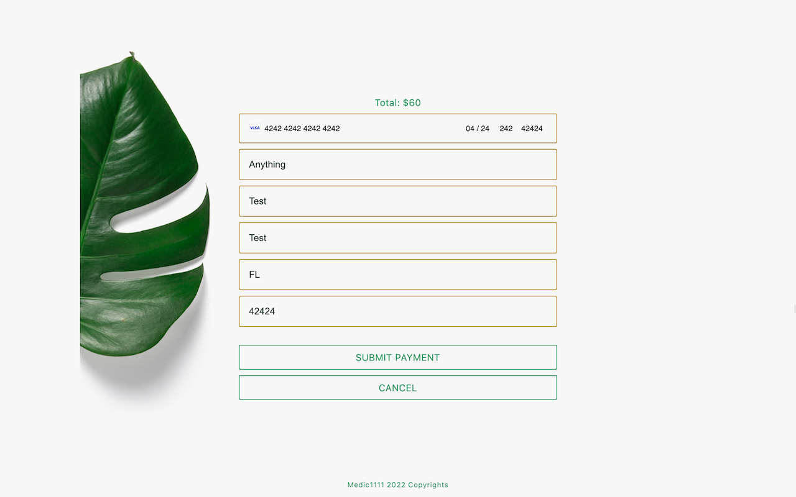
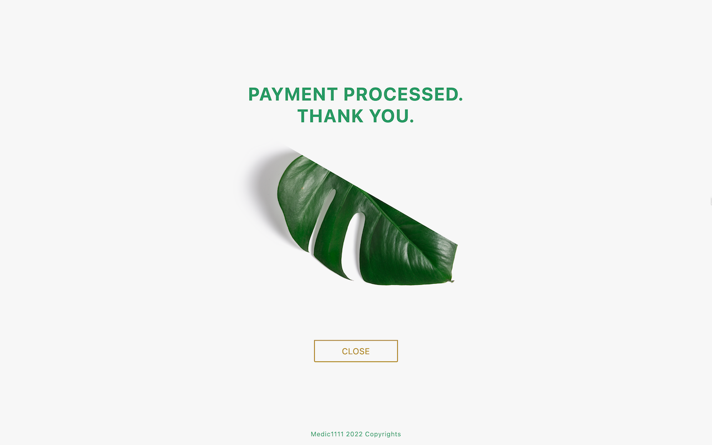

# MONSTERA-SHOP

Minimalist online shopping for monstera plants

---
> [TypeScript simplified Client-only version here](https://github.com/Medic1111/MONSTERA-SHOP-CLIENT-ONLY-TYPESCRIPT)
---

[LIVE-VERSION](https://monstera-shop.herokuapp.com/)

## TECH:

1. FRONT-END:

- React

2. BACK-END:

- NodeJs
- Express
- Stripe

## STEPS:

1. Download the doc and run `npm install` to install all the dependencies

2. Use `node server/index.js` to run the server/ alternatively use nodemon

3. On a different terminal, run `cd client` and then `npm start`

## TEST CREDENTIALS:

- CARD NUMBER: 4242 4242 4242 4242
- EXP-DATE: 0424
- CVC:242
- ZIP: 42424

1. Select an Item and add to cart
2. Open cart

3. Click on `Check out`
4. Enter the test info: 42 pattern

5. Receive confirmation message

## THE IDEA

###### Minimal Me

As a minimalist, I can trully appreciate simple and straight-forwardness in just about any utility

While planning on my next project which was set to be an e-commerce, I was very little inspired with the typical...shoes, clothing, material goods in general

What to 'pretend' to sell that would truly inspire me?

###### My Rescue Monstera

The week prior to engaging in this project, I had the pleasure to rescue a suffering monstera and provide it with love and care it much needed

It was love at first sight...and between staring at her and staring at my blank project, the idea came

I would be able to unite a inspiring target, with the minimalist simple approach, to come up with my e-commerce

###### The Goal

The goal was to list the 3 types of monstera plants available widely in the market on a root page

Such page would be extremely easy to navigate, uncluttered, and to the point

Easy on the eye and on the brain, a simple click to add to cart

The cart is to open right away after an item is added, encouraging the purchase process

The user would then have the option to close the cart and continue shopping or proceed to check out

Check out is a simple form, with integrated STRIPE API for payment

Once payment is processed a confirmation modal appears and renders a success or fail message according to the status received by the server

If successful, the user will find themselves back at the root page, else, the user will find themselves back at the payment form modal

## Details

- An option to select quantity is not available at the item list displayed at the root page

- If the user clicks on an item that's already on cart, the amount ON THE CART will be updated

###### POSSIBLE IMPROVEMENT IDEAS

- [ ] The idea is to optimize the use of ReactDOM portal to its max extent
- [ ] Redux can be reconfig to also provide a leaner store
- [ ] At this point, the data being used is so minimal it's okay to be hard-coded, but perhaps just to maximize complexity a bit I would fetch it from DATABASE
- [ ] In the future, buttons will be a single component to be utilized dynamically

###### UNHAPPY ABOUT

- [ ] The mobile design lacks polish
- [ ] There's no tablet specific design
- [ ] Those are priorities on the list of upcoming adjustments

> ARYSE TANSY: Self-taught full-stack web developer on a life-long journey of learning and applying new skills.
